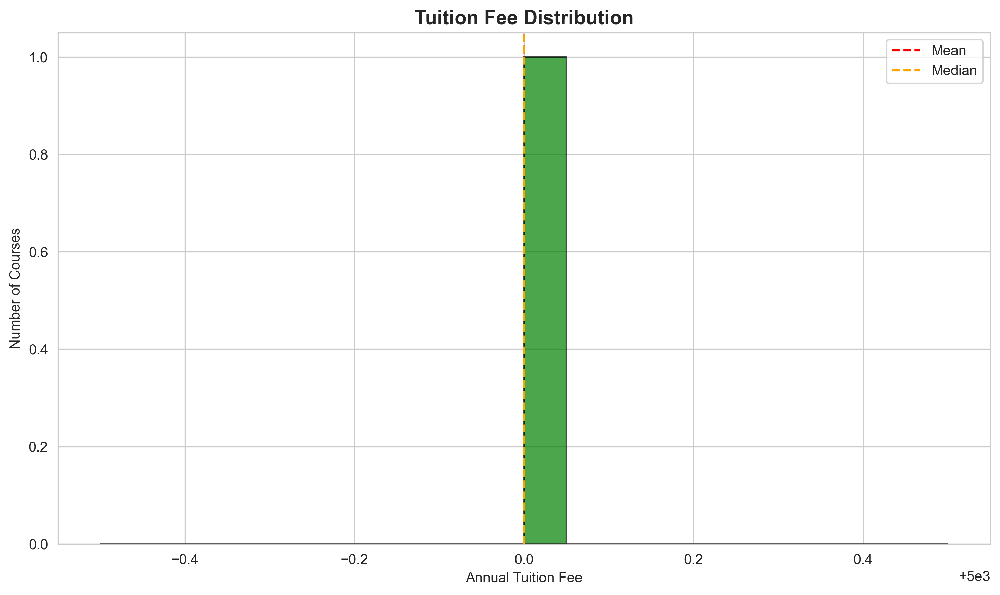
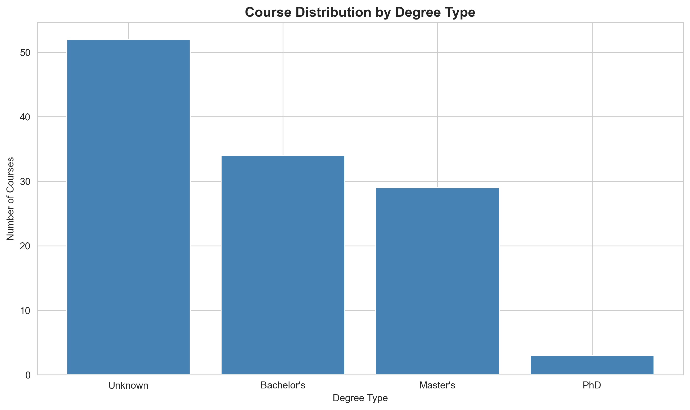

# University Fees Scraper 

## Overview
This repository hosts a robust data extraction and analysis pipeline designed to aggregate, clean, and analyze unstructured tuition fee data from UK university portals.

Unlike standard datasets, university pricing is often buried in HTML text. This project automates the retrieval process and applies **Unsupervised Machine Learning (K-Means Clustering)** to identify pricing tiers across different disciplines without manual labeling.

**Key Technical Competencies:**
* **Web Scraping:** Ethical crawling with `requests` and `BeautifulSoup`.
* **NLP Feature Extraction:** Using `TF-IDF` to vectorize course titles for analysis.
* **Unsupervised Learning:** K-Means clustering to discover latent groupings in course types.
* **Data Persistence:** Structured storage using `SQLite3` for relational querying. 

---

## 1. Methodology & Pipeline

The pipeline follows an ETL (Extract, Transform, Load) architecture:

1.  **Ingestion:** The scraper (`uni_scraper.py`) navigates the target domain, respecting server load with rate-limiting (`time.sleep`).
2.  **Extraction:** Regex patterns identify currency values within unstructured HTML blobs.
3.  **Storage:** Validated records are committed to a local relational database (`universities.db`).
4.  **Analysis:** A Jupyter Notebook (`analysis_notebook.ipynb`) connects to the DB to perform statistical profiling.

---

## 2. Automated Insights

### Pricing Distribution & Outliers
The initial analysis examines the spread of tuition fees to identify base rates and premium outliers (e.g., MBA or Clinical degrees).


*Figure 1: Histogram of tuition fees showing the central tendency and variance in pricing.*

### Unsupervised Clustering (AI-Driven)
To categorize courses without manual tagging, I implemented a **K-Means Clustering** algorithm on TF-IDF vectors of course titles. This automatically groups similar courses (e.g., "Engineering" vs "Humanities") to compare their pricing structures.

| Cluster Analysis | Degree Breakdown |
|:---:|:---:|
|  |  |
| *Figure 2: Pricing ranges identified by K-Means clusters.* | *Figure 3: Distribution of extracted degree types.* |

### Domain Analysis
The pipeline also extracts department-level data to quantify course offerings.


*Figure 4: The most active departments based on course volume.*

---

## 3. Ethical Considerations
This tool is designed for **academic research purposes only**.
* **Rate Limiting:** A mandatory delay is implemented between requests to prevent server overload.
* **User-Agent:** The scraper identifies itself clearly to allow webmasters to block access if necessary.
* **Data Privacy:** No personal identifiable information (PII) is scraped or stored.

---

## 4. Installation & Usage

To reproduce this pipeline locally:

```bash
# 1. Clone the repository
git clone [https://github.com/Hexicon404/university-fees-scraper.git](https://github.com/Hexicon404/university-fees-scraper.git)

# 2. Install requirements
pip install -r requirements.txt

# 3. Run the extraction pipeline
python uni_scraper.py
# (Follow prompts to enter target URL)

# 4. Run the analysis (Optional)
jupyter notebook analysis_notebook.ipynb
```

---

## Tech Stack
* **Language:** Python 3.9+
* **Scraping:** Requests, BeautifulSoup4 (Custom User-Agent rotation)
* **Data Processing:** Pandas, NumPy, Regex (Currency cleaning)
* **Storage:** SQLite3 (`universities.db`)
* **Machine Learning:** Scikit-Learn (TF-IDF Vectorization, K-Means Clustering)
* **Visualization:** Matplotlib, Seaborn

## Limitations
* **HTML Structure Dependency:** The extractor relies on DOM structures (e.g., `<h1>` tags for titles) which may vary across different university sub-domains.
* **Currency Parsing:** While robust for standard formats (e.g., "£12,500"), complex fee structures (e.g., "£10k + lab fees") are currently flagged for manual review.
* **Snapshot Validity:** Pricing data is valid only for the academic year present at the time of scraping.

## License
MIT License
